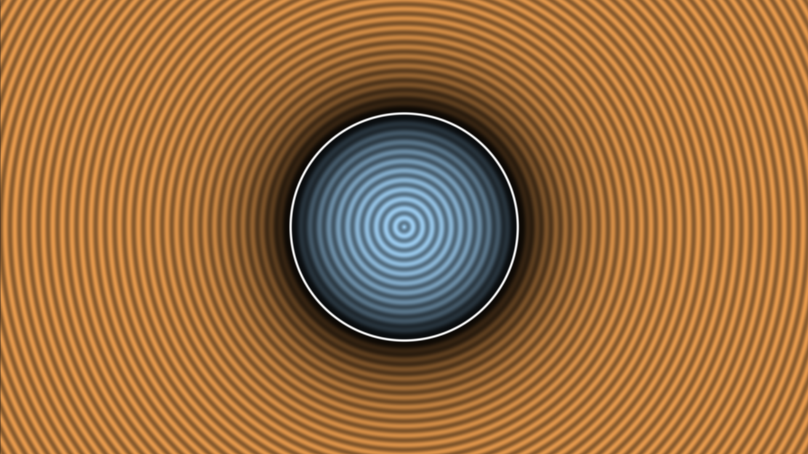

# description



This is a standalone, minimal Vulkan `hello triangle` example in pure C for Linux/XCB.

Many Vulkan tutorials or minimal examples use way too much boilerplate, are not standalone, support too many platforms, and are in C++.
This is an attempt to remedy that.

It follows:  
https://jhenriques.net/vulkan_shaders.html  
https://vulkan-tutorial.com/Introduction  

To compile, run:

```
gcc vk0.c -o vk0 -lxcb -lvulkan  -Wno-format-zero-length
gcc vk1.c -o vk1 -lxcb -lvulkan  -Wno-format-zero-length
```

`vk0` and `vk1` are distinct, independent examples, one simpler than the other.

[Repent of your sins and be baptized in the name of Jesus Christ for the remission of sins.](https://bible.com/bible/1/jhn.3)  

# high-level picture

In order to draw a fragment-shaded polygon with 3 vertices, you can use (roughly) the following Vulkan/XCB API calls:

```python
# initialization
vkCreateInstance()            # create a Vulkan instance
xcb_connect()
xcb_create_window()
vkCreateXcbSurfaceKHR()       # create an Vulkan-XCB surface
vkEnumeratePhysicalDevices()  # get a physical device
vkCreateDevice()              # create a logical device
vkCreateSwapchainKHR()
vkCreateImageView()
vkCreateRenderPass()
vkCreateShaderModule()
vkCreatePipelineCache()
vkCreateGraphicsPipelines()   # the most complicated call in the whole program
vkCreateFramebuffer()
vkCreateCommandPool()
vkAllocateCommandBuffers()
vkCreateSemaphore()
vkCreateFence()

# render loop
vkWaitForFences()
vkResetFences()
vkAcquireNextImageKHR()
vkResetCommandBuffer()
vkBeginCommandBuffer()
vkCmdBeginRenderPass()
vkCmdBindPipeline()
vkCmdSetViewport()
vkCmdSetScissor()
vkCmdDraw()
vkCmdEndRenderPass()
vkEndCommandBuffer()
vkQueueSubmit()
vkQueuePresentKHR()
vkDeviceWaitIdle()

# clean-up
xcb_destroy_window()
xcb_disconnect()
vkDestroySemaphore()
vkDestroySemaphore()
vkDestroyFence()
vkDestroyCommandPool()
vkDestroyPipeline()
vkDestroyPipelineCache()
vkDestroyPipelineLayout()
vkDestroyRenderPass()
vkDestroyImageView()
vkDestroyFramebuffer()
vkDestroySwapchainKHR()
vkDestroyDevice()
vkDestroySurfaceKHR()
vkDestroyDebugUtilsMessengerEXT()
vkDestroyInstance()
```

--------------------------------------------------------------------------------------------------------------------------------
# sources

https://registry.khronos.org/vulkan/  
https://registry.khronos.org/SPIR-V/  
https://registry.khronos.org/vulkan/specs/1.3/registry.html  
https://renderdoc.org/vulkan-in-30-minutes.html  
https://registry.khronos.org/vulkan/specs/1.3-extensions/pdf/vkspec.pdf  
https://registry.khronos.org/SPIR-V/specs/unified1/SPIRV.html  

https://github.com/KhronosGroup/Vulkan-Samples  
https://github.com/KhronosGroup/Vulkan-Guide  
https://github.com/KhronosGroup/Vulkan-Loader/blob/master/docs/LoaderInterfaceArchitecture.md  
https://github.com/KhronosGroup/Vulkan-ValidationLayers  
https://github.com/KhronosGroup/SPIRV-Headers  
https://github.com/KhronosGroup/Vulkan-Samples/tree/master/samples/performance/swapchain_images  

https://momentsingraphics.de/ToyRenderer4RayTracing.html  

# notes

- vk shaders are all in spir-v binary
- vk is a stateless API
- command buffers
- commend queues
- vulkan xml API registry and scripts for processing it
- is this how you pass variable arguments to functions in C? by using custom arg struct for each function? not too bad! it's like a function signature spec, or something. you can definitely implement that in a C abstraction layer

- vulkan is a layered API. There is a core layer that we are calling into, but inbetween the API calls and the loader other "layers" can intercept the API calls. The ones we are interested in here are the validation layers that will help us debug and track problems with our usage of the API.
- you want to develop your app with this layers on but when shipping you should disable them
- a physical device represents 1 GPU
- a logical device is how the app keeps track of the physical device
- each physical device defines the number &ss type of queues it admits (eg. compute and graphics queues)
- vulkan render-passes use attachments to describe input and output render targets.
- don't forget to disable layers when done debugging?

- validation layers are optional components that hook into Vulkan fn calls to apply extra ops. common ops in validation layers are:
	- checking the values of parameters against the specification to detect misuse
	- tracking creation and destruction of objects to find resource leaks
	- checking thread safety by tracking the threads that calls originate from
	- logging every call and its parameters to the standard output
	- tracing Vulkan calls for profiling and replaying

- vulkan rendering:
	- wait for the previous frame to finish
	- acquire an image from the swap chain
	- record a command buffer which draws the scene onto that image
	- submit the recorded command buffer
	- present the swap chain image

- 2 semaphores in vk: binary & timeline

# vk vulkan

## VK_KHR_surface
An instance extension. introduces VkSurfaceKHR objects, which abstract native platform surface or window objects to use with Vulkan.  
Provides a way to determine whether a queue family in a physical device supports presenting to particular surface.  
Separate extensions for each platform provide the mechanisms for creating VkSurfaceKHR objects, but once created they may be used in this and other platform-independent extensions, in particular the VK_KHR_swapchain extension.  

## VK_KHR_xcb_surface

## VK_EXT_debug_report (deprecated)
vkCreateDebugReportCallbackEXT()  
vkDestroyDebugReportCallbackEXT()  
vkDebugReportMessageEXT()  

----------------------------------------------------------------
git init
gitc
git remote add origin https://github.com/etale-cohomology/vulkan-examples.git
git push -uf origin master

----------------------------------------------------------------
cd $git
git clone --recursive https://github.com/SaschaWillems/Vulkan.git  &&  cd Vulkan

mkcd build && cmake .. && make -j 28
t py download_assets.py

----------------------------------------------------------------
cd $git
git clone --recurse-submodules https://github.com/KhronosGroup/Vulkan-Samples  &&  cd Vulkan-Samples

cmake -G "Unix Makefiles" -H. -Bbuild/linux -DCMAKE_BUILD_TYPE=Release  &&  cmake --build build/linux --config Release --target vulkan_samples -- -j28  &&  ./build/linux/app/bin/Release/x86_64/vulkan_samples --help
